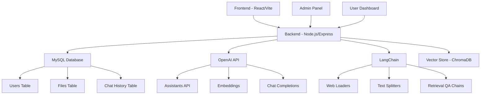
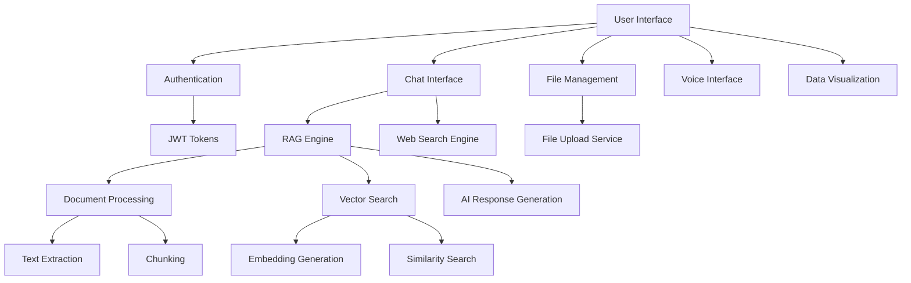

# RAG AI Chat Application

## Overview

The RAG AI Chat Application is a sophisticated web-based platform that leverages Retrieval-Augmented Generation (RAG) technology to provide intelligent conversational AI capabilities. The application allows users to interact with an AI chatbot that can answer questions based on uploaded documents, perform web searches, and offer voice-based interactions. It features a comprehensive admin panel for user and content management.

## Objectives

The primary objectives of this project are:

1. **Intelligent Document-Based Q&A**: Enable users to upload various document formats (PDF, DOCX, TXT) and receive accurate answers based on the content using RAG technology.

2. **Web Search Integration**: Allow users to query web pages directly by providing URLs, extracting and processing web content for contextual responses.

3. **Multi-Modal Interaction**: Provide both text-based and voice-based interaction modes for enhanced user experience.

4. **User Management System**: Implement a robust authentication and authorization system with role-based access control (admin vs. regular users).

5. **Admin Panel**: Offer administrators tools to manage users, upload knowledge base documents, and oversee system operations.

6. **Data Visualization**: Include features for visualizing data and insights derived from interactions.

7. **Scalable Architecture**: Build a modular, scalable application using modern web technologies.

## Features

### Core Features
- **RAG Chatbot**: Uses OpenAI's Assistants API with file search capabilities for document-based Q&A
- **Web Search**: Integrates LangChain for web content extraction and processing
- **Voice Assistant**: Supports voice-based interactions
- **File Upload**: Supports PDF, DOCX, and TXT file uploads for knowledge base
- **User Authentication**: JWT-based authentication with role management
- **Admin Dashboard**: Comprehensive admin interface for system management

### Technical Features
- **Vector Search**: Utilizes OpenAI embeddings for semantic search
- **Real-time Chat**: Streaming responses for better user experience
- **File Processing**: Automatic text extraction from various document formats
- **Database Integration**: MySQL database for user and file management
- **Responsive UI**: Modern, responsive interface built with React and Tailwind CSS

## Architecture



### Component Diagram



## Technology Stack

### Frontend
- **React 18**: Modern React with hooks and functional components
- **TypeScript**: Type-safe JavaScript
- **Vite**: Fast build tool and development server
- **Tailwind CSS**: Utility-first CSS framework
- **React Router**: Client-side routing
- **Axios**: HTTP client for API calls
- **React Markdown**: Markdown rendering
- **Heroicons**: Icon library

### Backend
- **Node.js**: JavaScript runtime
- **Express.js**: Web framework
- **MySQL**: Relational database
- **JWT**: JSON Web Tokens for authentication
- **bcrypt**: Password hashing
- **Multer**: File upload handling
- **CORS**: Cross-origin resource sharing

### AI/ML Libraries
- **OpenAI API**: GPT models and Assistants API
- **LangChain**: Framework for LLM applications
- **ChromaDB**: Vector database
- **Cheerio**: Web scraping
- **PDF-lib**: PDF processing
- **Mammoth**: DOCX processing
- **Groq SDK**: Alternative LLM provider

### Development Tools
- **Nodemon**: Development server auto-restart
- **Webpack**: Module bundler
- **ESLint**: Code linting
- **Prettier**: Code formatting

## Prerequisites

Before running the application, ensure you have the following installed:

- **Node.js** (>= 14.16.0)
- **npm** (comes with Node.js)
- **MySQL** database server
- **Git** for version control

### Environment Variables

Create a `.env` file in the server directory with the following variables:

```env
OPENAI_API_KEY=your_openai_api_key
GROQ_API_KEY=your_groq_api_key
ILOVEPDF_PUBLIC_KEY=your_ilovepdf_public_key
ILOVEPDF_PRIVATE_KEY=your_ilovepdf_private_key
BRIGHTDATA_API_KEY=your_brightdata_api_key
```

## Installation and Setup

### 1. Clone the Repository

```bash
git clone https://github.com/ANZER03/RAG-AI-APP.git
cd RAG-AI-APP
```

### 2. Database Setup

1. Create a MySQL database named `chat-bot`
2. The application will automatically create the necessary tables on first run

### 3. Backend Setup

```bash
cd server
npm install
```

### 4. Frontend Setup

```bash
cd ../frontend
npm install
```

## Running the Application

### Development Mode

1. **Start the Backend Server**:
   ```bash
   cd server
   npm run dev
   ```
   The server will start on `http://localhost:5000`

2. **Start the Frontend Development Server**:
   ```bash
   cd frontend
   npm run dev
   ```
   The frontend will be available at `http://localhost:5173`

### Production Build

1. **Build the Frontend**:
   ```bash
   cd frontend
   npm run build
   ```

2. **Start the Backend**:
   ```bash
   cd server
   npm start
   ```

## Usage

### User Registration and Login

1. Access the application at `http://localhost:5173`
2. Register a new account or sign in with existing credentials
3. Regular users have access to chat, voice, and profile features

### Admin Features

1. Admin users can access the admin panel at `/admin`
2. **File Management**: Upload PDF, DOCX, or TXT files to the knowledge base
3. **User Management**: View, add, edit, and delete user accounts
4. **System Oversight**: Monitor system usage and manage content

### Using the Chatbot

1. Navigate to the Chat dashboard
2. Type your question in the input field
3. For document-based questions: The AI will search through uploaded documents
4. For web-based questions: Include a URL in your query to search web content
5. The chatbot supports markdown rendering for rich responses

### Voice Assistant

1. Access the Voice Assistant page
2. Use voice commands for hands-free interaction
3. The system processes audio input and provides text/voice responses

### File Upload

1. Admin users can upload files through the Chatbot Files page
2. Supported formats: PDF, DOCX, TXT
3. Files are processed and indexed for RAG queries

## API Endpoints

### Authentication
- `POST /api/user/login` - User login
- `POST /api/user/register` - User registration
- `GET /api/user/details` - Get user details

### Chat
- `POST /api/chat` - Send chat message (RAG-based)
- `POST /api/search` - Web search query
- `GET /api/chat/history` - Get chat history

### File Management
- `POST /api/upload1-pdf` - Upload files
- `GET /api/files` - List user files
- `DELETE /api/files/:filename/:userId` - Delete file

### Admin
- `GET /api/user/all` - Get all users
- `PUT /api/user/:id` - Update user
- `DELETE /api/user/:id` - Delete user

## Database Schema

### Users Table
```sql
CREATE TABLE users (
  id INT AUTO_INCREMENT PRIMARY KEY,
  fullName VARCHAR(255) NOT NULL,
  email VARCHAR(255) UNIQUE NOT NULL,
  password VARCHAR(255) NOT NULL,
  role ENUM('user', 'admin') DEFAULT 'user',
  created_at TIMESTAMP DEFAULT CURRENT_TIMESTAMP
);
```

### Files Table
```sql
CREATE TABLE files (
  id INT AUTO_INCREMENT PRIMARY KEY,
  user_id INT NOT NULL,
  filename VARCHAR(255) NOT NULL,
  file_data LONGBLOB NOT NULL,
  uploaded_at TIMESTAMP DEFAULT CURRENT_TIMESTAMP,
  FOREIGN KEY (user_id) REFERENCES users(id)
);
```

## Security Features

- **JWT Authentication**: Secure token-based authentication
- **Password Hashing**: bcrypt for secure password storage
- **Role-Based Access Control**: Admin and user role separation
- **Input Validation**: Server-side validation for all inputs
- **CORS Configuration**: Proper cross-origin resource sharing setup

## Performance Optimizations

- **Streaming Responses**: Real-time streaming for AI responses
- **File Chunking**: Efficient processing of large documents
- **Vector Indexing**: Fast similarity search with ChromaDB
- **Caching**: Response caching for frequently asked questions
- **Lazy Loading**: On-demand loading of components

## Future Enhancements

- **Multi-language Support**: Expand language capabilities
- **Advanced Analytics**: Detailed usage analytics and reporting
- **Integration APIs**: Third-party service integrations
- **Mobile App**: Native mobile application development
- **Advanced RAG**: Implement more sophisticated RAG techniques
- **Custom Models**: Fine-tuned models for specific domains

## Contributing

1. Fork the repository
2. Create a feature branch (`git checkout -b feature/AmazingFeature`)
3. Commit your changes (`git commit -m 'Add some AmazingFeature'`)
4. Push to the branch (`git push origin feature/AmazingFeature`)
5. Open a Pull Request

## License

This project is licensed under the ISC License - see the [LICENSE](LICENSE.md) file for details.

## Acknowledgments

- **TailAdmin** for the UI template
- **OpenAI** for AI capabilities
- **LangChain** for LLM framework
- **React Community** for excellent documentation and tools

## Support

For support, please contact the development team or create an issue in the GitHub repository.

---

**Repository**: [RAG-AI-APP](https://github.com/ANZER03/RAG-AI-APP)
**Version**: 1.3.0
**Last Updated**: October 28, 2025
